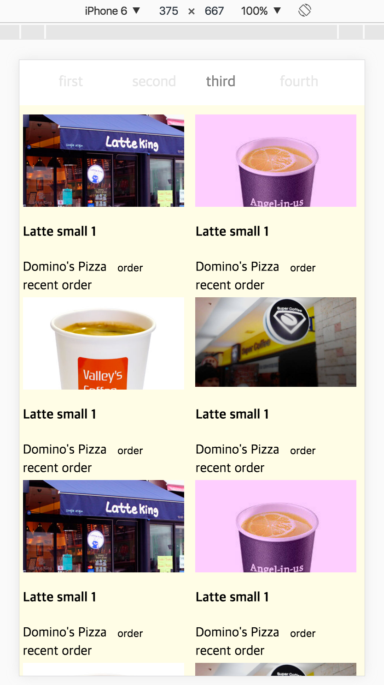
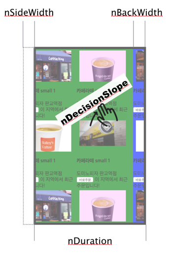
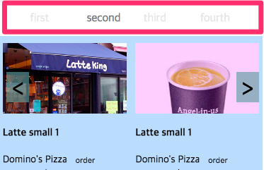
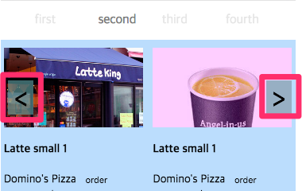

SweetSwipe
============
A lightweight swiping(flicking) mobile web component.

<br>
## Demo

* <a href="https://skplanet.github.io/sweetswipe/demo/swipe.html" target="_blank">Base demo</a>
* <a href="https://skplanet.github.io/sweetswipe/demo/swipe_circular.html" target="_blank">Circular demo</a>



<br>
## Feature

* lightweight (vanillaJS)
* CSS3 based fast animation
* multiple options and plugins

<br>
## Compatibility 

| Device | Browser | 
| ------ | ------- |
| Desktop| IE9+, FF, Chrome, Safari |
| Mobile | Android 4.x, Chrome, Safari |

<br>
## Install

* npm install
* gulp buildJS (ES6 -> ES5)
* import script

```HTML
<script src="../dist/swipe_merge_es5.js"></script>
```

## Usage - HTML 

```HTML
   <div class="viewArea">
        <div id="swipeWrap">
            <div>menu1-list</div>
            <div>menu2-list </div>
            <div>menu3-list </div>
        </div>
    </div>
```

## Usage - CSS 
```CSS
	.viewArea {
        overflow: hidden;
        height: 200px;
    }

    #swipeWrap {
        position : relative;
        width :100%;
        -webkit-transform: translate3d(0px, 0px, 0px);
        transform: translate3d(0px, 0px, 0px);
    }

    #swipeWrap div {
        width :100%;
        position: absolute;
        top: 0;
        height: 200px;
    }

    #swipeWrap div:nth-child(1) {
        transform: translate3d(0%, 0px, 0px);
        -webkit-transform: translate3d(0%, 0px, 0px);
        background-color: red;
    }
    #swipeWrap div:nth-child(2){
        background-color: green;
        transform: translate3d(0%, 0px, 0px);
        -webkit-transform: translate3d(100%, 0px, 0px);
    }
    #swipeWrap div:nth-child(3){
        transform: translate3d(200%, 0px, 0px);
        -webkit-transform: translate3d(200%, 0px, 0px);
        background-color: blue;
    }

```

<br>
## Usage - JavaScript

```javascript

  var oMyswipe = new SweetSwipe($("#swipeWrap"), {
      'bCircular': true,'           // default : false
      'nDuration': 100,             // 100
      'nBackWidth': 60,             // 60
      'nSideWidth': 20,             // 0
      'nDecisionSlope': 0.8,        // 0.8
      'nForcedSwipeTime': 100,      // 0
      'bSettingScreenHeight': false // false
      'bMouseEventSupport': true    // false
    });

```

<br>
## Options 

| Option | Description|
| ------ | -----------|
| bCircular | A boolean that circulate swipe gesture |
| nDuration | A milisecond during swiping animation |
| nBackWidth | A touchmove moving distance that can be executed swiping |
| nSideWidth | A dummy width to show at first and last panel |
| nDecisionSlope | A touchmove slope that can be executed swiping |
| nForceSwipeTime | A milisecond that can be executed swiping regardless of touch moving distance|
| bSettingScreenHeight |A boolean that set content height whenever end of swiping animation|
| bMouseEventSupport | A boolean that can be executed swiping by mouse events |




<br>
## Custom function
You can register custom function that executed at specific point of time.

| Custom function | Description | Parameter |
| --------------- | ----------- | --------- |
| FN_BEFORE_SWIPE | Before swiping | current panel order (0~n)|
| FN_AFTER_SWIPE | After swiping | current panel order (0~n)|
| FN_COMPONENT_DID_LOAD | After component initialization ||


#### Usage
```javascript
    oMyswipe.registerUserMethod({
      'FN_BEFORE_SWIPE': function(n){},
      'FN_AFTER_SWIPE': function(n){},
      'FN_COMPONENT_DID_LOAD' : function(){console.log("end of component init");}
    });
```

<br>
## API
| Function | Description | return | Parameter |
| -------- | ----------- | ------ | --------- |
| getCurrentViewNumber() | Get panel order number | Number(0~n) : panel order | |
| runSwipeAction(n,n) | Move to specific panel | | Number(millisecond) : anmation duration , Number : panel order to move(0~n) |


<br>
## Usage of Circular swiping

##### JavaScript
```javascript
   'bCircular': true,
```

##### HTML
You have to add two cloned elements (first and last element).
If your page's swiping panel is three, you have to add elements as follows.
"1234 -> 412341"
The reason for this is to minimize a reflow.

Reference code : [go to demo page]( https://github.com/skplanet/sweetswipe/blob/master/demo/dev_circular_app.html)


##### CSS

```CSS
 #swipeWrap > div:nth-child(1) {
                -webkit-transform: translate3d(-100%, 0px, 0px);
            }
            #swipeWrap > div:nth-child(2){
                -webkit-transform: translate3d(0%, 0px, 0px);
            }
            #swipeWrap > div:nth-child(3){
                -webkit-transform: translate3d(100%, 0px, 0px);
            }

            #swipeWrap > div:nth-child(4){
                -webkit-transform: translate3d(200%, 0px, 0px);
            }

            #swipeWrap > div:nth-child(5){
                -webkit-transform: translate3d(300%, 0px, 0px);
            }

            #swipeWrap > div:nth-child(6){
                -webkit-transform: translate3d(400%, 0px, 0px);
            }
```

<br>
##  Plugin - SwipeNavigationPlugin
Tab menu navigation UI.



```HTML
  <ul>
    <li class="selected-swipe-li"><a href="#">first</a></li>
    <li class="mockclass"><a href="#">two</a></li>
    <li><a href="#">third</a></li>
    <li><a href="#">fourth</a></li>
  </ul>
```

```javascript
  oMyswipe.onPlugins([
    { 
     'name': 'SwipeNavigationPlugin',
     'option': {
       'usage': true,
       'elNaviWrap': document.querySelector("#swipeNaviWrap > ul"),
       'seletedClassName': 'selected-swipe-li',  // CSS class name of selected element.
       'nDuration': 200,   //swipe animation duration(millisecond).
       'bMouseEventSupport': true  //click event support
      },
      'userMethod' : {}
    }
  ]);
```

<br>
##  Plugin - SwipeStepMoverPlugin
Button menu navigation UI




```HTML
  <div class="buttonNavi">
    <button class="swipe-prev"><</button>
    <button class="swipe-next">></button>
  </div>
```


```javascript
  oMyswipe.onPlugins([
    'name'      : 'SwipeStepMoverPlugin',
    'option'    : {
      'prevButton' : document.querySelector(".swipe-prev"),
      'nextButton' : document.querySelector(".swipe-next"),
      'nDuration': 200
    },
    'userMethod' : {}
  ]);
```

<br>
## Contributing
See our [CONTRIBUTING.md](https://github.com/skplanet/sweetswipe/blob/master/CONTRIBUTING.md) for information on how to contribute.

<br>
## License
MIT Licensed. Copyright (c) 2016 SK PLANET. All Rights Reserved.


